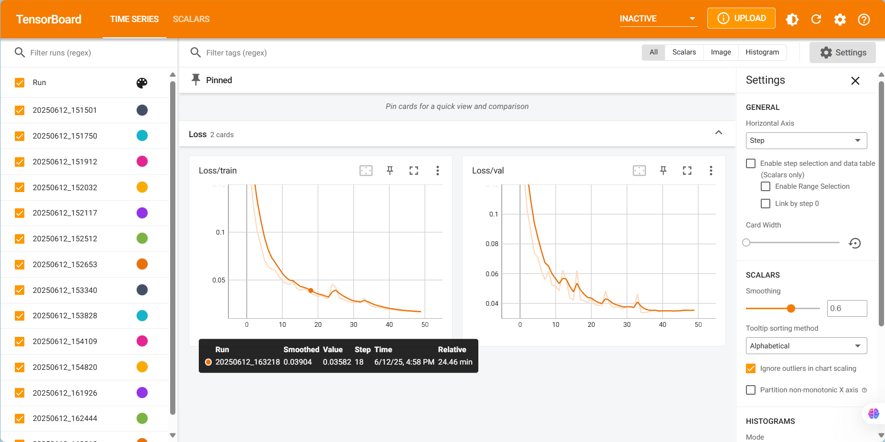
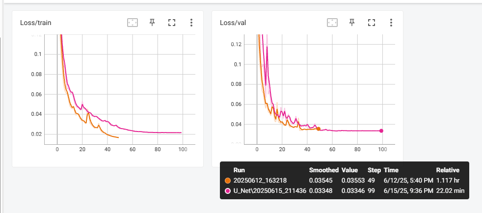

# Lab Report: Image Segmentation for Photovoltaic Panel Detection  

## Background  
- **Dataset Description**  
  - Training Set: 2,693 images  
  - Test Set A: 336 images  
  - Test Set B: 338 images (final evaluation criterion)  
- **Evaluation Metrics**  
  - Intersection over Union (IoU)  
  - $\frac{TP}{TP+FP+FN}$  
- **Image Specifications**  
  - Input Image Size: 160×128 pixels  
  - Image Naming Convention: `image0.JPG`  
  - Mask Naming Convention: `mask0.JPG`  
  - Prediction Naming Convention: `pred0.JPG`  

## Command Line Usage for Training/Prediction and Logging  
```shell  
python run.py --config configs/base.yaml  # Training  
```  

```shell  
python src/predict.py --model_path outputs/checkpoints/best_model.pth --test_dir data/testA --output_dir submissions/22211870121  # Prediction  
```  

```shell  
tensorboard --logdir=outputs/logs/{model_name}  # Visualization  
```  

## Experimental Process  
1. Using the U-Net model  

## Common Pitfalls and Solutions  
1. **Data Augmentation Not Synchronized with Masks** (e.g., horizontal/vertical flipping) wasted significant training time (validation loss performed worse than without augmentation).  
2. **Correction**: Masks should undergo spatial transformations (e.g., flipping) but not pixel-level transformations (e.g., brightness adjustments). Use Albumentations with mask protection (reference: [CSDN Blog](https://ask.csdn.net/questions/8364948)).  
3. Initially relied on `val_loss` as the evaluation metric, but changing the loss function made models incomparable. Switched to **IoU on validation set** for evaluation and used **early stopping** to reduce unnecessary training time.  

## Experimental Records  
| Model           | Transforms                       | Loss                          | IoU (TestA) | IoU (Val) |  
|-----------------|----------------------------------|-------------------------------|-------------|-----------|  
| U-Net           | None                             | DiceBCELoss                   | 0.9667      | 0.9700    |  
| U-Net           | Basic + CoarseDropout + RandomBright | DiceBCE + Edge Loss + Focal Loss | 0.9573      | -         |  
| U-Net           | HorizontalFlip                   | DiceBCELoss                   | -           | 0.9721    |  
| U-Net           | HorizontalFlip + CoarseDropout   | DiceBCELoss + L2 Regularization | -           | 0.9722    |  
| U-Net           | HorizontalFlip + CoarseDropout + RandomBright | DiceBCELoss + L2 Regularization | -           | 0.9696    |  
| R2AttU_Net (t=2)| HorizontalFlip                   | DiceBCELoss                   | -           | 0.69      |  
| R2AttU_Net (t=1)| HorizontalFlip                   | DiceBCELoss + L2 Regularization | -           | 0.7094    |  

## Key Observations  
1. **Overfitting with Complex Models**: Larger models (e.g., R2AttU_Net) performed poorly, likely due to dataset simplicity.  
2. **Ineffective Augmentation for Complex Models**: Even with heavy augmentation, complex models underperformed, possibly because PV panels have simple structures (e.g., rectangular shapes, low background noise).  
3. **U-Net’s Advantage**: Skip connections in U-Net preserved local details effectively, while models like DeepLabV3+ (with ASPP) may introduce redundant computations.  

## Training Visualizations  
1. **U-Net Training Process**  
     
2. **U-Net Dual-Experiment Comparison**  
     

## References  
1. [DeepLabV3+ Implementation](https://github.com/VainF/DeepLabV3Plus-Pytorch/blob/master/network/modeling.py)  
2. [nnUNet Training Script](https://github.com/MIC-DKFZ/nnUNet/blob/master/nnunetv2/run/run_training.py)  
3. [Nested U-Net Training](https://github.com/4uiiurz1/pytorch-nested-unet/blob/master/train.py#L252)  
4. [U-Net Implementation](https://github.com/zhixuhao/unet)  
5. [Solar Panel Mapping](https://github.com/PiyushBagde/SolarMap)